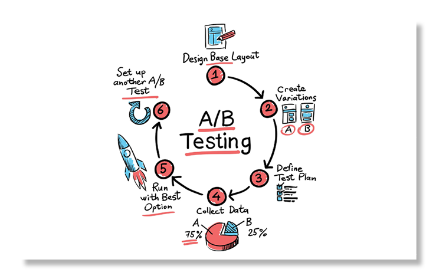

# Introduction - Bayesian A/B Testing (Beta-Binomial)¹

<figure>

  

<figcaption align="center"><b>Figure.</b> A/B Testing.</figcaption>
</figure>
 

In machine learning, A/B testing emerges as a critical tool for developers and data scientists aiming to fine-tune their models and deliver the best possible outcomes. This technique, rooted in statistical hypothesis testing, allows for comparative analysis between two versions of a model to determine which performs better in real-world scenarios.

The theoretical performance of a machine learning model, often assessed through measures like accuracy, precision, recall, or F1 score, does not always translate directly into real-world effectiveness. These measures quantify how well a single model performs, whereas A/B testing determines, via randomized experimentation, whether one model or change causally outperforms another in practice.

Here, I'm gonna go through a Bayesian formulation of A/B testing using the beta-binomial model.

# Tech Stack

**ML | Data Science**

🧠 Beta-binomial model

🤖 numpy • pandas • PyMC • preliz

📊 seaborn • matplotlib

# Methods

## 1. What problem is being modeled?

We are modeling a conversion process. Each user / email / page view results in either:

- **Success** (conversion = 1)  
- **Failure** (no conversion = 0)

Each observation is a **Bernoulli trial**, repeated $n$ times.

The core unknown quantity is the **true conversion rate** $\theta$, which we do not observe directly.

## 2. The binomial distribution (data model / likelihood)

### What it represents

The **binomial distribution** models the number of conversions we expect *if the conversion rate were known*:

$$
k \sim \text{Binomial}(n, \theta)
$$

Where:

- $n$: number of trials (e.g. 50 emails)  
- $\theta$: conversion probability (e.g. 0.2)  
- $k$: number of observed conversions  

This answers the question:

> *If the true conversion rate were 20%, how many conversions would I expect out of 50?*

**Important:**  
At this stage, $\theta$ is assumed to be known. This is not realistic, but it defines the **likelihood**.

## 3. The beta distribution (prior over conversion rate)

### Why a beta distribution?

- Conversion rates are probabilities and that's why they are bounded in $[0, 1]$
- The **Beta distribution** is flexible and conjugate to the binomial

$$
\theta \sim \text{Beta}(\alpha, \beta)
$$

This expresses a **prior belief** about the conversion rate:

- Mean $\approx 0.28$ (for example, $\alpha = 2, \beta = 5$)  
- Wide uncertainty  

Interpretation:

> *Before seeing any data, I believe the conversion rate is probably around 28%, but I am not very confident.*

We can think of $\alpha - 1$ and $\beta - 1$ as pseudo-counts of past successes and failures.

## 4. Bayesian update (core idea)

Bayesian inference combines prior beliefs with observed data:

$$
\text{Posterior} \propto \text{Prior} \times \text{Likelihood}
$$

For the **beta-binomial model**, the posterior distribution has a closed form:

$$
\theta \mid k, n \sim \text{Beta}(\alpha + k,\; \beta + n - k)
$$

After observing data:

- Beliefs about $\theta$ are updated  
- Uncertainty decreases as more data is collected  

This is the conceptual meaning of the Bayesian update.

## 5. The beta-binomial model (put together)

Suppose we observe the following data for version A:

- $n = 100$ users  
- $k = 8$ conversions  
- Observed conversion rate = 8%

Typical questions we want to answer:

- What is the true conversion rate?  
- How uncertain are we about it?  
- What happens if we repeat the experiment?  

The model answers these questions by:

- Placing a **beta prior** on the conversion rate  
- Using a **binomial likelihood** for the observed data  
- Producing a **posterior distribution** over conversion rates  

The posterior distribution - not a single point estimate - is the key Bayesian output.

## 6. How this becomes A/B testing

For **A/B testing**, the same model is applied independently to each variant.

For version A:

$$
\theta_A \sim \text{Beta}(\alpha_A, \beta_A)
$$

For version B:

$$
\theta_B \sim \text{Beta}(\alpha_B, \beta_B)
$$

From the posterior distributions, we compute quantities such as:

- $P(\theta_B > \theta_A)$
- Expected lift $\mathbb{E}[\theta_B - \theta_A]$
- Credible intervals for the difference  

This directly answers the question:

> *What is the probability that B is better than A?*

No p-values are required.

## 7. Summary

- **Binomial distribution**: models observed counts given a fixed conversion rate  
- **Beta distribution**: models uncertainty about the conversion rate  
- **Bayesian update**: turns observed data into updated beliefs  
- **Beta-binomial model**: a minimal, principled model for A/B testing  
- **Posterior distributions** replace point estimates

Here, I focused on binary conversion outcomes modeled with a beta-binomial framework; extensions to count-based or time-to-event data would naturally involve Poisson likelihoods and Gamma priors (it's in the notebook).

Beta-binomail frawework is used when we assume that each experiment / variant / group is independent and should be analyzed on its own. That works only when we have enough data per group. **Hierarchical models** are introduced because real data is usually sparse, noisy, and unevenly distributed. In such models we assume that each group has its own parameter, but those parameters come from a shared population. So we can say that each group has a conversion rate, and those rates are related. Partial pooling here means: 1) small groups get pulled toward the global mean and 2) large groups are allowed to deviate more. And **gamma distribution** here controls how much groups are allowed to differ.

- **Hierarchical beta-binomial**: analyzes many related experiments jointly  
- **Partial pooling**: stabilizes estimates for small samples  
- **Population-level inference**: learns how experiments vary overall  

---
¹Implemented as part of the workshops at the [PyData Global conference 2025](https://pydata.org/global2025)