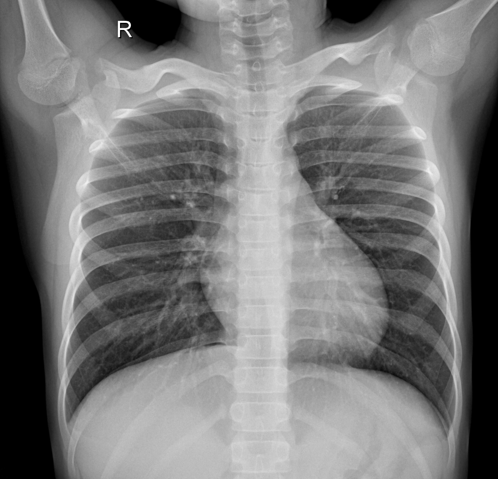
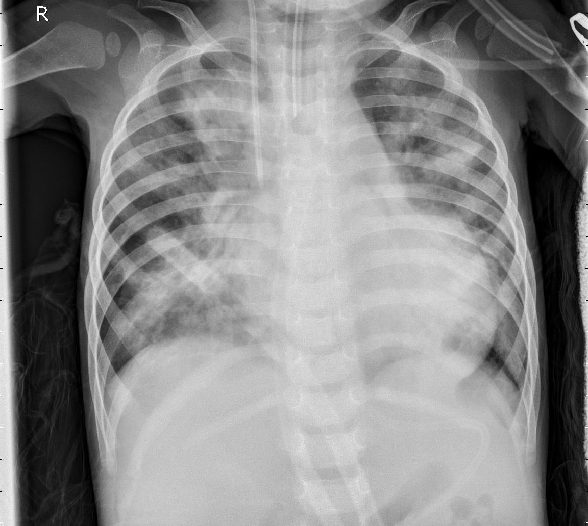
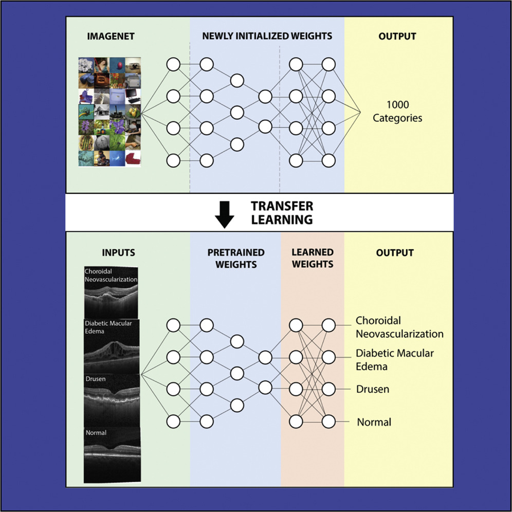

# Introduction

Chest X-ray imaging is a critical diagnostic tool in detecting various pulmonary diseases. However, manual interpretation of chest X-rays can be time-consuming and prone to variability between radiologists. To address these challenges, deep learning techniques - particularly **Convolutional Neural Networks (CNNs)** - have been widely adopted for automated medical image analysis due to their ability to learn hierarchical visual features directly from data.

In this project, a CNN was developed to classify chest X-ray images using relatively small 224x224 and also 64×64 pixel inputs, aiming to explore whether lightweight models can still retain sufficient diagnostic power for image-based classification tasks. Beyond training a basic CNN from scratch, **transfer learning** was employed by leveraging pretrained convolutional backbones such as ResNet, to assess whether pre-trained models can further enhance classification performance when applied to chest X-ray images.

The objective was to compare the effectiveness of a simple CNN versus a transfer learning approach, focusing on model generalization, convergence speed, and performance on a limited dataset.

## Convolutional neural networks


For this example, I will use the [chest X-ray data-set](https://drive.google.com/file/d/1Y9iTkRrfh_2UfoG9o8CRjZc_3rj73nap/view)
from [Kermany et al. 2018](https://www.sciencedirect.com/science/article/pii/S0092867418301545?via%3Dihub).

| normal | pneumonia |
| --- | --- |
|  |  |
 

Here is a refresher on CNN: [CNN cheatsheet](https://stanford.edu/~shervine/teaching/cs-230/cheatsheet-convolutional-neural-networks), and an amazing video [lecture](https://www.youtube.com/watch?v=oGpzWAlP5p0). 


## Transfer Learning


Here, I will continue working on the chest x-ray dataset, from [Kermany et al. 2018](https://www.sciencedirect.com/science/article/pii/S0092867418301545?via%3Dihub), but this time I will use transfer learning described in the original paper.



The base model I will re-use is [ResNet50](https://pytorch.org/vision/main/models/generated/torchvision.models.resnet50.html) from [Deep Residual Learning for Image Recognition](https://arxiv.org/abs/1512.03385). With inspirations from [this github repo](https://github.com/liyu95/Deep_learning_examples/blob/master/4.ResNet_X-ray_classification/Densenet_fine_tune.ipynb) and [this kaggle thread](https://www.kaggle.com/code/iamsdt/transferlearning-pytorch-resnet-50).


# Methods


## Set-up

Project structure:
```{bash}
├── config.yaml
├── data/
│   ├── chest_xray_224/
│   │   ├── train/ NORMAL/ PNEUMONIA/
│   │   └── test/  NORMAL/ PNEUMONIA/
│   └── chest_xray_63/      # optional smaller dataset
└── src/
    ├── data.py             # dataset + dataloaders
    ├── model.py            # CNN model definition
    ├── train.py            # training loop
    └── eval.py             # evaluation loop
```


Create and activate an environment (e.g., via conda or venv):
```{bash}
conda env create -f environment.yml
conda activate xray_cnn
```

Install dependencies::
```{bash}
pip install -r requirements.txt
```


## Quickstart

### Train

Train the CNN using the default configuration (config.yaml):

```{bash}
python -m src.train
```

Example output:
```{bash}
(xray-cnn) katwre@katwre-XPS-13-9350:~/projects/ML-projects/CNN_and_TransferLearning_Xray$ python -m src.train
[train] cfg=config.yaml data_dir=data/chest_xray_224 device=cpu
[train] batches: train=82 val=10

============================================================
[INFO] Model architecture:

CNN(
  (conv): Sequential(
    (0): Conv2d(1, 2, kernel_size=(16, 16), stride=(4, 4))
    (1): ReLU(inplace=True)
    (2): MaxPool2d(kernel_size=2, stride=2, padding=0, dilation=1, ceil_mode=False)
    (3): Conv2d(2, 4, kernel_size=(5, 5), stride=(1, 1))
    (4): ReLU(inplace=True)
    (5): MaxPool2d(kernel_size=2, stride=2, padding=0, dilation=1, ceil_mode=False)
  )
  (flatten): Flatten(start_dim=1, end_dim=-1)
  (classifier): Sequential(
    (0): Linear(in_features=484, out_features=16, bias=True)
    (1): Linear(in_features=16, out_features=8, bias=True)
    (2): Linear(in_features=8, out_features=1, bias=True)
    (3): Sigmoid()
  )
)

[INFO] Detailed summary:
==========================================================================================
Layer (type:depth-idx)                   Output Shape              Param #
==========================================================================================
CNN                                      [1, 1]                    --
├─Sequential: 1-1                        [1, 4, 11, 11]            --
│    └─Conv2d: 2-1                       [1, 2, 53, 53]            514
│    └─ReLU: 2-2                         [1, 2, 53, 53]            --
│    └─MaxPool2d: 2-3                    [1, 2, 26, 26]            --
│    └─Conv2d: 2-4                       [1, 4, 22, 22]            204
│    └─ReLU: 2-5                         [1, 4, 22, 22]            --
│    └─MaxPool2d: 2-6                    [1, 4, 11, 11]            --
├─Flatten: 1-2                           [1, 484]                  --
├─Sequential: 1-3                        [1, 1]                    --
│    └─Linear: 2-7                       [1, 16]                   7,760
│    └─Linear: 2-8                       [1, 8]                    136
│    └─Linear: 2-9                       [1, 1]                    9
│    └─Sigmoid: 2-10                     [1, 1]                    --
==========================================================================================
Total params: 8,623
Trainable params: 8,623
Non-trainable params: 0
Total mult-adds (M): 1.55
==========================================================================================
Input size (MB): 0.20
Forward/backward pass size (MB): 0.06
Params size (MB): 0.03
Estimated Total Size (MB): 0.30
==========================================================================================

[INFO] Total parameters: 8,623
[INFO] Trainable parameters: 8,623
============================================================

Epoch 01: train_loss=0.5752 acc=0.742 | val_loss=0.6902 acc=0.625                                                                                                                            
Epoch 02: train_loss=0.5716 acc=0.742 | val_loss=0.6988 acc=0.625                                                                                                                            
Epoch 03: train_loss=0.5712 acc=0.742 | val_loss=0.6909 acc=0.625                                                                                                                            
Epoch 04: train_loss=0.5718 acc=0.742 | val_loss=0.6921 acc=0.625                                                                                                                            
Early stopping.
Training finished. Best val loss: 0.690
```

You can override settings without editing config.yaml:
```{bash}

# use smaller 63px dataset
python -m src.train --data_dir data/chest_xray_63

# use more workers / bigger batch size
python -m src.train --num_workers 4 --batch_size 64
```

Checkpoints & outputs:

- Best model: outputs/cnn_best_{model}.pt
- Metrics printed at the end of each epoch
- Early stopping based on validation loss


### Evaluate

Evaluate the best saved checkpoint (default: outputs/cnn_best.pt):
```
python -m src.eval
```


## Change backbone
Set `model.name` in `config.yaml` to `resnet50` or `efficientnet_b0` (if supported by your torchvision).


# Results

## Baseline CNN (from scratch)

A custom CNN was trained on 64×64 grayscale chest X-ray images to evaluate how well a lightweight architecture could learn from limited-resolution data.

- Training accuracy: ~92%
- Validation accuracy: ~82–83%
- Early stopping: triggered after 10–12 epochs to prevent overfitting
- Loss behavior: Binary cross-entropy (BCE) loss showed smooth convergence, with mild validation loss increase post–early stopping — a sign of good regularization.

Despite the reduced image resolution, the model retained enough discriminative signal to perform robustly. This confirmed that key diagnostic patterns (e.g., opacities or asymmetries) remain visible even after aggressive downsampling.


## Transfer Learning (ResNet + Deep Head)


To further enhance generalization and convergence speed, transfer learning was applied using a pretrained ResNet backbone paired with a custom fully connected head (Deep_LR).The pretrained visual features significantly improved model stability and sensitivity to pneumonia-related patterns.

Initial evaluation with the default threshold (0.5) produced a ROC–AUC of 0.834, but the probability outputs were skewed toward the pneumonia class, misclassifying most normal cases. After tuning the decision threshold via Youden’s J statistic (optimal cutoff ≈ 0.6865), performance became well-balanced:

| Class     | Precision | Recall |    F1 |
| --------- | --------: | -----: | ----: |
| NORMAL    |     0.681 |  0.739 | 0.709 |
| PNEUMONIA |     0.835 |  0.792 | 0.813 |


- Overall accuracy: 77.2%
- ROC–AUC: 0.834


## Take-aways

- Even a simple CNN can effectively learn from low-resolution (64×64) medical images.
- Transfer learning provides faster convergence and better generalization, especially for small datasets.
- Threshold calibration is crucial in medical AI — improving class balance and clinical interpretability.
- Pretrained representations from natural images (like ResNet) can transfer well to medical imaging tasks after minimal adaptation.
