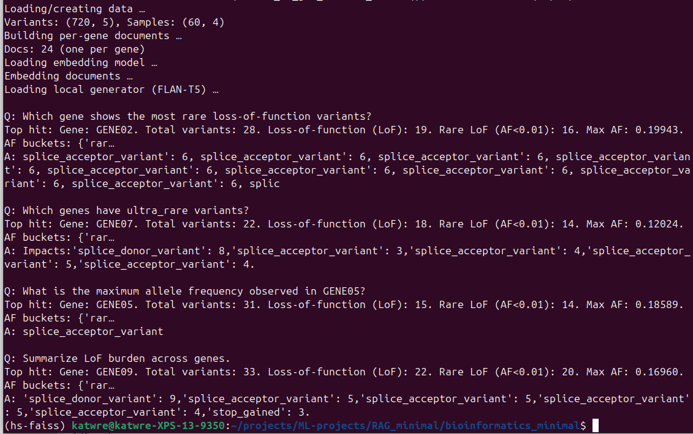

# Introduction

# Methods

## Example 1 : Minimal RAG; Sentence-Transformers + FLAN-T5 (local) [minimal]

This project is a tiny, dependency-light demo of Retrieval-Augmented Generation (RAG) built with just two libraries:
- Sentence-Transformers for semantic embeddings and retrieval
- Hugging Face Transformers for local text generation (FLAN-T5)

Unlike heavier frameworks, this script is ~30 lines and runs fully offline (no API keys). It shows the core RAG loop end-to-end: embed → retrieve → generate.

What this does:

1. Loads a small corpus of 3 sentences about RAG/semantic search.
2. Builds 384-dim embeddings with sentence-transformers/all-MiniLM-L6-v2.
3. Given a query (e.g., "What is RAG and how does Haystack help build it?"), finds the top-k most similar corpus sentences via cosine similarity.
4. Concatenates the retrieved passages into a Context.
5. Prompts a local FLAN-T5 model to generate an answer grounded in that context.

You should soon see two printed Q/A pairs like:

Q: What is RAG and how does Haystack help build it?

A: ...

Q: What is semantic search?

A: ...

As an example:

## Example 2: Bioinformatics RAG with Local Embeddings & LLM [bioinformatics_minimal]

This project demonstrates a Retrieval-Augmented Generation (RAG) pipeline tailored for bioinformatics using variant annotations.
The goal is to answer domain-specific biological questions, such as identifying genes with rare loss-of-function (LoF) variants, summarizing allele frequency distributions, and analyzing variant impacts across a cohort. Unlike standard RAG frameworks that depend on external APIs or vector databases, this project uses local embeddings and a local LLM for full offline functionality.

We integrate your existing `variants.tsv` input dataset into a **semantic search engine**, allowing natural-language queries like:

> *"Which genes show ultra-rare loss-of-function variants?"* 

> *"List missense variants with AF < 1% in TP53."*  

> *"Show rare frameshift variants in the Discovery cohort."*

As an example:

## Bioinformatics Context

Semantic search is valuable for:
- Identifying genes enriched for rare LoF variants.
- Quickly summarizing variant landscapes across thousands of samples.
- Supporting researchers who may not know exact column names or annotation terms.
- Laying the groundwork for retrieval-augmented genomics assistants that combine structured data with scientific literature.

