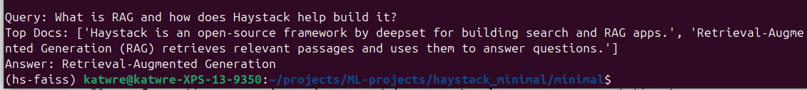

# Introduction

# Methods

## Example: Minimal RAG: Sentence-Transformers + FLAN-T5 (local) [minimal]

This project is a tiny, dependency-light demo of Retrieval-Augmented Generation (RAG) built with just two libraries:
- Sentence-Transformers for semantic embeddings and retrieval
- Hugging Face Transformers for local text generation (FLAN-T5)

Unlike heavier frameworks, this script is ~30 lines and runs fully offline (no API keys). It shows the core RAG loop end-to-end: embed → retrieve → generate.

What this does:

1. Loads a small corpus of 3 sentences about RAG/semantic search.
2. Builds 384-dim embeddings with sentence-transformers/all-MiniLM-L6-v2.
3. Given a query (e.g., "What is RAG and how does Haystack help build it?"), finds the top-k most similar corpus sentences via cosine similarity.
4. Concatenates the retrieved passages into a Context.
5. Prompts a local FLAN-T5 model to generate an answer grounded in that context.

You should soon see two printed Q/A pairs like:

Q: What is RAG and how does Haystack help build it?
A: ...

Q: What is semantic search?
A: ...

As an example:

