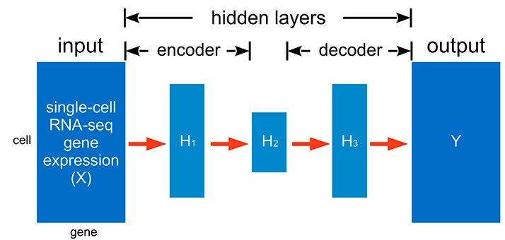
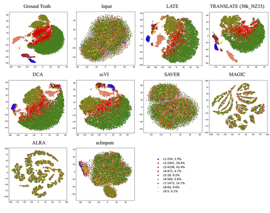
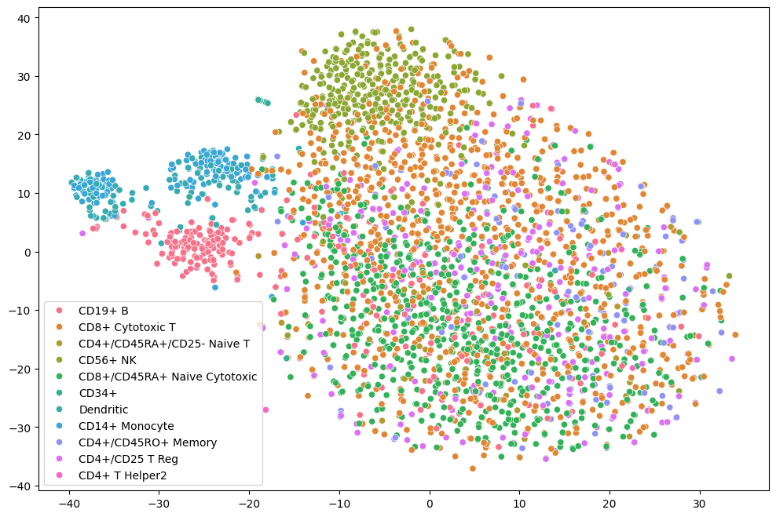
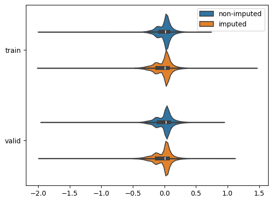

# Introduction

 Here, I implemented a simple autoencoder with a custom loss function for single-cell RNA-seq data imputation. This approach is inspired by [Badsha et al.](https://www.ncbi.nlm.nih.gov/pmc/articles/PMC7144625/), who proposed an fairly elegant autoencoder-based method for imputing missing values in single-cell datasets.

 
*Figure 1A of Badsha et al. 2020*

Single-cell sequencing technologies have revolutionized biology with the ability of measuring molecular phenotypes (e.g., gene expression) in individual cells. However, due to technical limitations, single-cell gene expression data often contain a large number of zeros many of which do not indicate no expression, but are rather technical artifacts. In the [Badsha et al.](https://www.ncbi.nlm.nih.gov/pmc/articles/PMC7144625/) paper, they treat zeros as missing values and develop nonparametric deep learning methods for imputation. Specifically, they developed model called LATE (Learning with AuToEncoder) that trains an autoencoder with random initial values of the parameters, whereas the method called TRANSLATE (TRANSfer learning with LATE) further allows for the use of a reference gene expression data set to provide LATE with an initial set of parameter estimates. The original code from the publication: https://github.com/audreyqyfu/LATE/tree/master.

# Methods

To reproduce their method, I'll first build a basic autoencoder for gene expression data from scRNA-seq. Then, I'll modify the loss function to focus learning on the observed (non-missing) values, encouraging the model to recover true biological signal rather than fitting noise caused by caused by dropout events (missing data points).

Using real gene expression data sets (from bulk tissues and single cells) in human and mouse (see section of “Data availability”), we generated several synthetic data sets, including the input and the corresponding ground truth, for assessing the performance of imputation methods (summary statistics of the data sets in Supplementary Table S1).

Several methods have been developed recently to impute missing values in scRNA-seq data. Some methods, such as MAGIC and scImpute, use similarity among cells for imputation, whereas other methods, including SAVER (Single-cell Analysis Via Expression Recovery), DCA (Deep Count Autoencoder) and scVI (single-cell Variational Inference), rely on similarity among genes. The latter methods effectively treat cells as independent samples and model the read counts in scRNA-seq data with a negative binomial distribution. Additionally, DCA and scVI take a deep learning approach and develop deep neural networks also based on autoencoders. However, whereas DCA and scVI assume read counts to follow a negative binomial distribution and estimate parameters of this distribution as part of the inference with their autoencoders, LATE does not make explicit assumptions on read counts. ALRA (Adaptively-thresholded Low-Rank Approximation) performs randomized Singular Value Decomposition (SVD) on the gene expression matrix; whether the genes or cells are features is irrelevant with this approach. This aspect is similar to the LATE/TRANSLATE methods that can take either genes or cells as features. Additionally, scVI accounts for batch effects in their statistical model and removes batch effects in imputation. Other methods, including LATE/TRANSLATE, do not address batch effects.

Here, I'll focus on this synthetic PBMC_G949_10K dataset based on the 10x Genomics PBMC data with known cell types downloaded from https://github.com/audreyqyfu/LATE/tree/master/data .

*Figure 5A of Badsha et al. 2020: tSNE plots of cells from the synthetic data based on the 10x Genomics PBMC data with known cell types (PBMC_G949_10K; 949 genes and 10K cells)*

# Results

I turned the autoencoder into a missing data imputation tool:
- In a typical autoencoder: The model learns to reconstruct its full input, minimizing the reconstruction loss across all input features.
- In an imputer: The goal is different - reconstruct or predict only the missing parts of the input, using the available data.

By adjusting the loss to focus only on non-missing values, the autoencoder becomes a model that learns to fill in missing data - turning it from a reconstruction tool into a data imputation tool.

 
 *Figure: Imputed scRNA-seq.*

This simple model can both reconstruct observed values and impute missing values without large bias. The errors are small and centered around zero for both reconstructed and imputed data, suggesting that the autoencoder has learned a reasonable latent representation of the gene expression data.

 
 *Figure: Model's output and the true gene expression values. Non-imputed data (blue): where the model reconstructed known values. Imputed data (orange): where the model predicted missing (masked) values.*

