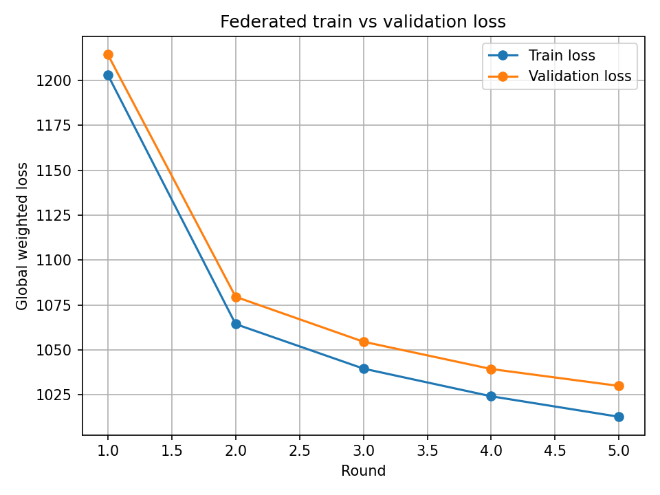

# Overview

In recent years, there has been growing concern about the risks associated with data usage, particularly when it comes to **data sharing**. This has led to the introduction of stricter **data management regulations**, which have had a significant impact on scientific research. The effect is especially pronounced in the **biomedical field**, where the sensitivity of the data makes conducting **multi-institutions studies** more challenging.

To address these challenges, [Federated Learning (FL)](https://en.wikipedia.org/wiki/Federated_learning) has gained popularity. FL enables multiple parties to collaboratively train a shared **machine learning model** using their local data **without directly sharing the data itself**. This enhances **privacy** and **security**, as highlighted in the [original FL paper](https://arxiv.org/pdf/1602.05629). The typical setup involves a central server that collects **non-sensitive information** from each data-holding site (e.g., parameters from a locally trained model) and aggregates them into a **global model**.

In this project, I train a **deep-learning** scVI model in a **federated setting** together with secure aggregation using the SecAgg+ protocol, and also train the same model in a centralized manner. Finally, I compare the effectiveness of the federated and centralized approaches on data from a new (previously unseen) institution.

Imagine a scenario where several institutions worldwide each hold pancreas **single-cell datasets**, generated using different sequencing technologies. These institutions collaborate to train an **open-source model** for **technology-related batch-effect removal** using an architecture provided by [scVI-tools](https://scvi-tools.org/), with the goal of publishing and sharing the resulting model through a journal article. Because the **raw data is not intended to be shared across sites**, the partners adopt **federated learning** with the [Flower framework](https://flower.ai/). This allows each institution to train the model locally, while only exchanging model updates with a central server to build a global model. Later, a separate institution - which also holds pancreas single-cell data - discovers the publication and wishes to use the released model. This is particularly valuable for them because their dataset was generated using two different sequencing technologies (one machine failed mid-study and was replaced), resulting in significant technology-driven batch effects. By applying the released model, they can remove these batch effects and proceed with downstream analyses more effectively.


# Methods


## Set Up the Environment

The `fl-course-env.yaml` file defines a Conda environment with all the required dependencies for this project.

### Create the environment:
```bash
conda env create -f fl-course-env.yaml
```

### Activate the environment:
```bash
conda activate fl-course-env
```

### Run the FL project using Flower:
```bash
flwr run .
```

# Results

## 1. Baseline Gene Expression UMAP
The first panel shows the **raw UMAP embeddings** of pancreas single-cell data before any batch-effect correction:

- **Left (tech):** Cells are separated mainly by **sequencing technology** (Celseq2 vs Smartseq2), indicating strong **technology-driven batch effects**.
- **Right (celltype):** While some cell-type structure is visible, the separation by technology dominates, making downstream analyses unreliable.


---

## 2. Centralized scVI Model
The second panel shows UMAP embeddings after training a **centralized scVI model** (all data pooled together):

- **Left (tech):** Cells from different sequencing technologies are well-mixed, demonstrating that the **centralized model successfully removes batch effects**.
- **Right (celltype):** Clear, compact clusters of known pancreas cell types emerge, indicating improved biological signal recovery.


---

## 3. Federated scVI Model
The third panel shows UMAP embeddings after training the **same scVI model** in a **federated learning setup** using the [Flower framework](https://flower.ai/) with **SecAgg+ secure aggregation**:

- **Left (tech):** Batch effects are substantially reduced compared to the baseline, though slightly less effectively than in the centralized model.
- **Right (celltype):** Distinct cell-type clusters are recovered, demonstrating that the federated approach preserves biological structure **without requiring raw data sharing**.


---

## 4. Federated Training and Validation Loss
The final plot shows the **global weighted loss** across five federated training rounds:

- Both **training** and **validation losses** decrease steadily, indicating stable convergence.
- The gap between the two curves remains small, suggesting that the federated model generalizes well and does **not overfit**.



---

## Summary of Findings
- The **federated scVI model** achieves **comparable performance** while maintaining **data privacy**.
- Federated learning is therefore a viable strategy for multi-institutional single-cell studies where **data sharing is restricted**.
