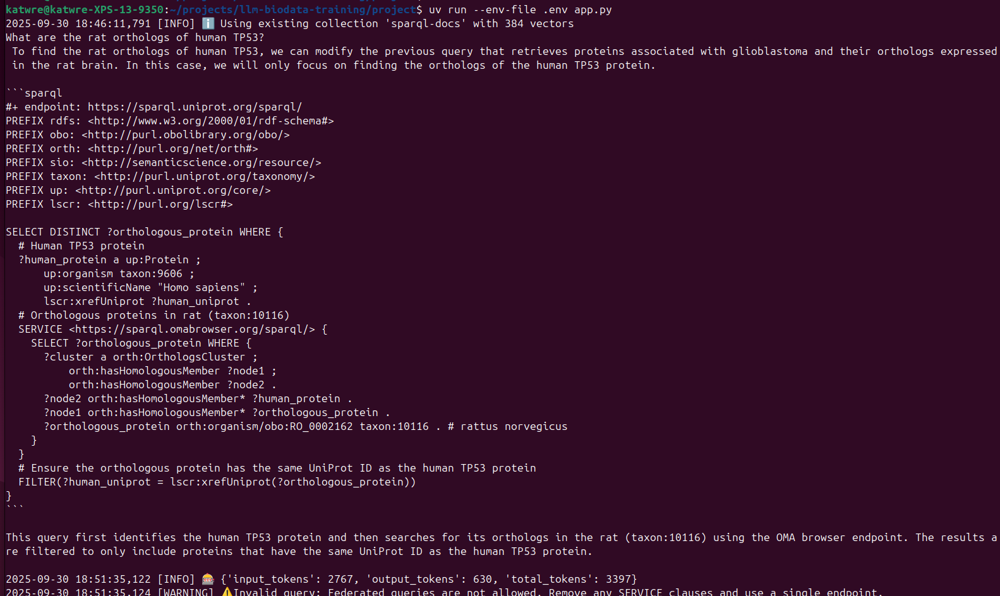
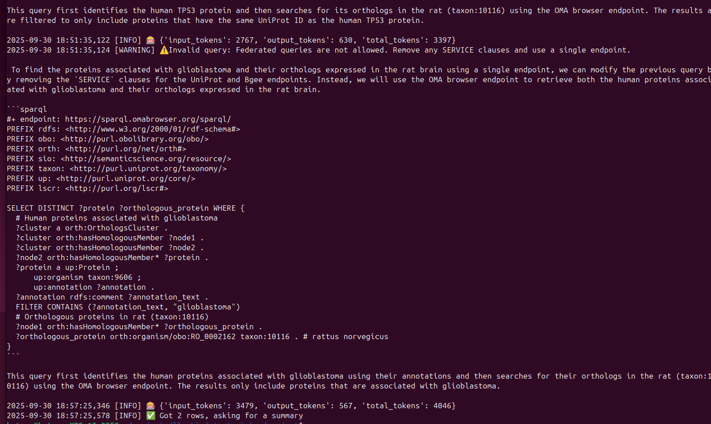
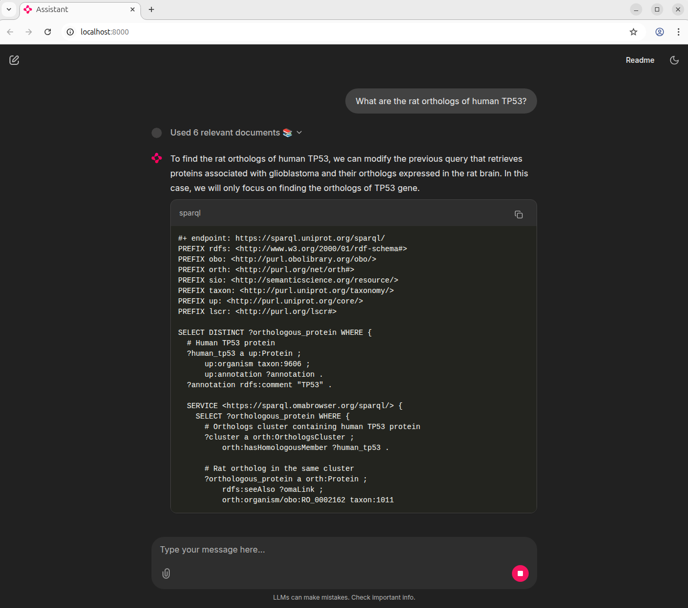
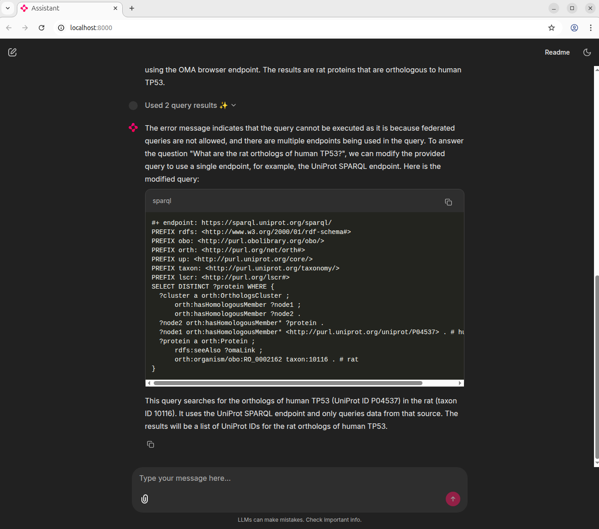

# Introduction

This project is an AI-powered assistant that helps researchers ask questions about biology in plain English and automatically turns them into SPARQL queries against public databases:
- UniProt (proteins, sequences, annotations), 
- OMA (orthologs / evolutionary relationships), 
- Bgee (gene expression in species)

The assistant is powered by LLMs (Mistral, Llama via Groq, Ollama) combined with retrieval-augmented generation (RAG) using Qdrant and FastEmbed.

Key goals:

- Allow researchers to query complex biological knowledge bases without writing SPARQL by hand.
- Validate and execute queries automatically.
- Provide results summarized in plain language.


# Methods

Here's how it works step by step:

1. Ask a question – You type a biology question in natural language.

2. Find examples – The system looks up similar example queries stored in a small database (Qdrant). Builds a mini "memory" (a vector database) of SPARQL examples and schemas from a few endpoints.

3. Generate a SPARQL query – A language model (LLM) uses these examples to write a new query.

4. Check the query – The system makes sure the query uses only one database and has the right format.

5. Run the query – The query is executed on a real SPARQL endpoint (like UniProt or OMA). Extract the generated query, validate it (must be single-endpoint, with an #+ endpoint: line), and run it. If it fails or returns nothing, ask the LLM to fix it. If it works, ask the LLM to summarize the rows.

6. Summarize the results – The results are returned and explained in plain text for easier understanding.

You can interact with the assistant either in the terminal/CLI or through a simple chat web app (Chainlit web UI).


### Example query

User: What are the rat orthologs of human TP53?


### To programmatically query LLM run it with:
```bash
uv run --env-file .env app.py
```




### Deploy with a nice web UI on http://localhost:8000 with:
```bash
uv run chainlit run app.py
```




# Results

## System process:

- Retrieved relevant SPARQL examples about orthologs.
- LLM first attempted a federated query (UniProt + OMA) → rejected by validator.
- LLM then produced a single-endpoint query against OMA.
- Query executed successfully, returning orthologous rat proteins.


# Conclusion

This project demonstrates an LLM-powered assistant capable of:
- Mapping natural-language biology questions to SPARQL queries.
- Validating and executing queries against real endpoints.
- Summarizing complex results into accessible answers for researchers.

The approach combines retrieval, reasoning, and execution into a closed-loop system, making SPARQL-based resources more accessible to life scientists.